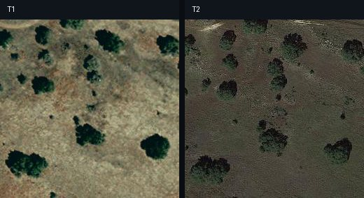
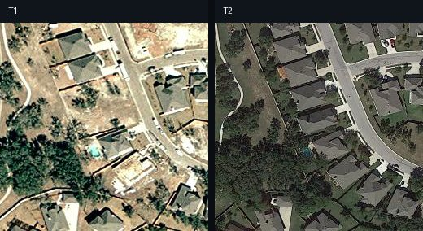
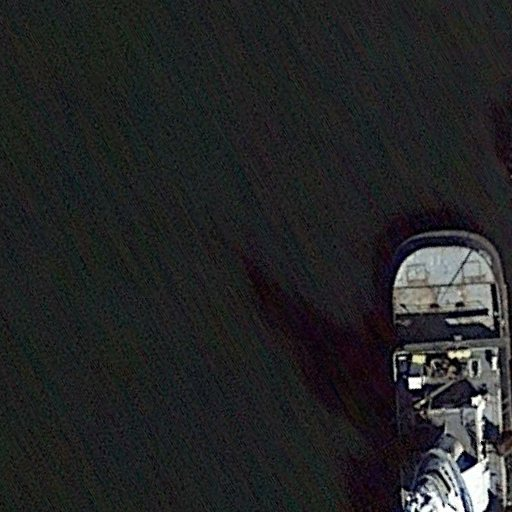
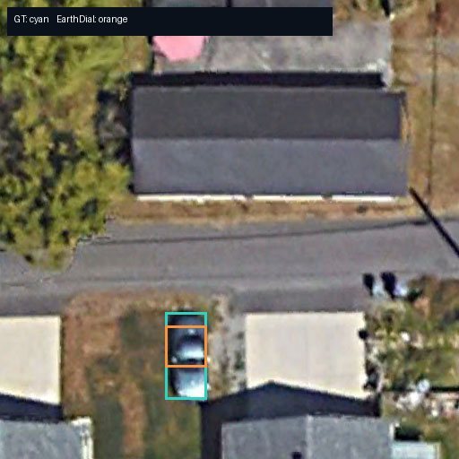
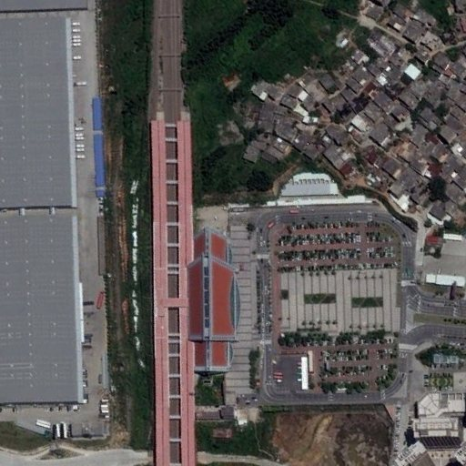
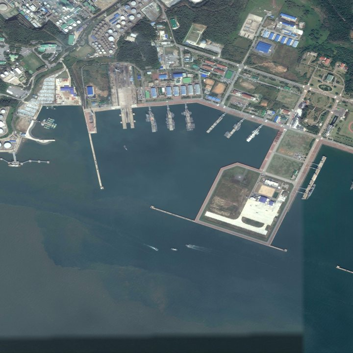

# RS-VL 典型样例极简对比

EarthDial_4B_RGB 与 Qwen2.5-VL-7B-Instruct 在 `smoke_val` 上的对比。每个现有“数据集 × 任务”组合选取 1 个典型案例；当前结果不含 MME-RS 与 XLRS-lite。定位图中青框为参考，橙框为 EarthDial。

## 用自然语言理解统计结果

两者最确定的差异是**运行稳定性**。在同一批 889 个样本上，EarthDial 完成了全部样本，Qwen 完成 753 个（84.7%），其余 136 个均因大尺寸 XLRS 图像触发 OOM。按同一样本配对比较，这一完成率差异极显著（精确配对二项检验，`p≈2.3×10⁻⁴¹`）。因此可以相当有把握地说：在当前硬件、当前预处理和当前推理参数下，EarthDial 对超大遥感图像明显更稳；这个结论不等于换显存或限制 Qwen 视觉 token 后仍会保持同样差距。

在**变化检测**的 40 个样本上，如果严格要求只输出 `change` 或 `no_change`，Qwen 正确 29 个（72.5%），EarthDial 正确 24 个（60.0%）。配对差异不显著（`p=0.359`），样本量也较小，所以不能据此断言某一个模型更准。EarthDial 有时会描述具体变化而没有返回规定标签，这会被严格匹配判错；这里同时测到了识别能力与指令遵循。

在 **VQA** 的 428 个样本上，严格字符串匹配时 EarthDial 为 91/428（21.3%），Qwen 为 25/428（5.8%），配对差异显著（`p≈4.3×10⁻¹⁴`）。但把标准放宽为“输出中连续包含参考答案词组”后，EarthDial 为 197/428（46.0%），Qwen 为 174/428（40.7%），差异只到临界水平（`p=0.052`）。这说明 EarthDial 的严格匹配优势有很大一部分来自回答短、格式直接；Qwen 经常给出较长解释，使自动精确匹配吃亏。若要判断真正的语义正确率，还需要人工复核或专门的答案判分器。

在**视觉定位**的 219 个样本上，Qwen 没有产生任何可解析的四坐标框：95 个 VRSBench 样本主要返回自然语言，124 个 XLRS 样本则全部 OOM。EarthDial 有 197/219（90.0%）能解析出框，因此在接口可用性上明显占优；但只有 14 个样本达到 `IoU≥0.5`，可解析框的平均 IoU 仅 0.099。这意味着“能稳定输出框”并不等于“框得准”，EarthDial 的定位精度仍有很大提升空间。

对**图像描述和变化描述**，当前结果只能稳妥比较完成率和输出风格，不能仅凭字数判断语义质量。Qwen 的平均输出明显更长：变化描述约 217 字符对 EarthDial 的 43 字符，普通图像描述约 692 对 217 字符。Qwen 往往更丰富，也更容易添加错误细节；EarthDial 更简洁、偏目标计数。大图中文描述中 Qwen 12/12 OOM，而 EarthDial 12/12 完成。没有 BLEU、CIDEr、BERTScore 或人工评分前，不宜声称谁的描述质量在统计上更高。

> 以上显著性检验都利用同一样本上的配对结果；文本指标是可复核的自动近似，不是完整语义评价。推理速度由于两模型运行条件不完全一致，未进行显著性比较。

## 典型案例

### 01｜LEVIR-MCI · 变化描述

- **尺寸**：256×256 + 256×256
- **问题**：Describe the changes between time 1 and time 2.
- **参考**：there is no difference .
- **EarthDial**：There is no difference.
- **Qwen2.5-VL**：The image on the right (Time 2) appears to be a zoomed-in or closer view of the same area as the left 1 (Time 1) image, showing more detail in the trees and ground textures.
- **观察**：无变化样本：EarthDial 命中参考；Qwen 把纹理差异解释成视角变化。
- **样本 ID**：`levir/train/train_000251/change_captioning`

### 02｜LEVIR-MCI · 变化检测

- **尺寸**：256×256 + 256×256
- **问题**：Is there any change between time 1 and time 2? Answer change or no_change.
- **参考**：change
- **EarthDial**：no_change
- **Qwen2.5-VL**：no_change
- **观察**：新增房屋样本：两者都回答 no_change，是一个简洁但重要的共同失败例。
- **样本 ID**：`levir/train/train_000461/change_detection`

### 03｜VRSBench · 图像描述

- **尺寸**：512×512
- **问题**：Describe the image in detail
- **参考**：This image from GoogleEarth captures a scene with a small ship located at the right side of the frame. The ship occupies a vertical strip from the middle towards the lower edge of the image. No other discernible objects or detailed resolution inform…
- **EarthDial**：In the satellite image, there is 1 gray large ship at the bottom right.
- **Qwen2.5-VL**：The image appears to be an aerial view of a tunnel or a bridge, with a significant portion of the structure visible through an opening. The tunnel or bridge seems to be part of a larger infrastructure, possibly a railway or road system. The surround…
- **观察**：EarthDial 识别出右下方大型船只；Qwen 将场景误判为隧道或桥梁。
- **样本 ID**：`vrsbench/train/001554`

### 04｜VRSBench · 视觉定位

- **尺寸**：512×512
- **问题**：where can I locate the The vehicle parked on the driveway near the bottom middle of the image is small and appears to be a sedan?
- **参考**：GT 框：[36.0, 68.0, 45.0, 87.0]（0–100）
- **EarthDial**：[[36, 71, 45, 80, 90]]
- **Qwen2.5-VL**：The vehicle you're referring to, which is a small sedan parked on the driveway in the bottom middle of the image, can can be located at the following location: - It is positioned in front of a house with a dark-colored roof. - The car is parked on a…
- **观察**：EarthDial 给出接近参考框的坐标；Qwen 只作文字解释，没有按要求输出框。
- **样本 ID**：`vrsbench/train/003711`

### 05｜VRSBench · VQA

- **尺寸**：512×512
- **问题**：Question: Is the large roof on the train station red? Short answer:
- **参考**：yes
- **EarthDial**：Yes
- **Qwen2.5-VL**：No, the large roof on the train station is not red. it appears to be a dark gray or black color.
- **观察**：参考答案为 yes：EarthDial 正确，Qwen 对车站屋顶颜色判断错误。
- **样本 ID**：`vrsbench/train/001453`

### 06｜XLRS 中文描述 · 图像描述

- **尺寸**：4096×4096
- **问题**：Describe the image in detail.
- **参考**：这幅遥感图像展示了一个综合性的海港区域，图像被细致地分为九个部分，每部分都揭示了海港的不同功能和特征。 在图像的左上角，看到成片的森林，还有工厂，工厂里面好多白色储物罐。中上继续是工厂以及茂密的森林，右上角继续展示的是工厂以及森林。 图像的左中部分是一个较大的陆地区域，可以看到一些绿色植被和几条小路，还有码头以及一些工厂。中间部分陆地上是大型的工厂，有很多大型建筑，码头则是有很多船只，右中则是一个大型的码头，陆地上则是一个大型的操场。 左下角到右下角展示的全部都是海洋。 整体上，这张图像描绘了…
- **EarthDial**：In the satellite image, there are 11 harbors and 40 ships anchored at the harbor at the center. The majority of the ships are gray in color, with 24 of them being gray. Additionally, there are 20 ships anchored at the harbor at the left side of the …
- **Qwen2.5-VL**：__ERROR__: CUDA out of memory. Tried to allocate 8.00 GiB. GPU
- **观察**：4096² 大图：Qwen 直接 OOM；EarthDial 完成推理，但输出偏目标计数而非整体场景描述。
- **样本 ID**：`xlrs_caption_zh/train/data-00001-of-00023/00011`

### 07｜XLRS 中文定位 · 视觉定位

- **尺寸**：7360×4912
- **问题**：给定一个7360 x 4912像素的卫星图像。以格式[xmin, ymin, xmax, ymax]给出描述中对象的定位框，其中左上角的坐标是(x_min, y_min)，右下角的坐标是(x_max, y_max)。你应该直接回答定位框，无需进一步解释。 描述：要定位的是图片右侧中心区域的矩形湖泊，它的上方是另一个湖泊和多种车辆，左侧是空地和灰色屋顶建筑，…
- **参考**：GT 框：[81.0, 43.4, 95.9, 68.2]（0–100）
- **EarthDial**：[[51, 39, 59, 45, 0]]
- **Qwen2.5-VL**：__ERROR__: CUDA out of memory. Tried to allocate 7.85 GiB. GPU
- **观察**：7360×4912 大图：Qwen OOM；EarthDial 能返回框，但与参考湖泊位置明显不符。
- **样本 ID**：`xlrs_grounding_zh/train/f777b5b99518e06dd699`

## 初步结论（对生成结果抽样得出）
- EarthDial_4B_RGB更加稳定，完成了发烟测试集中的所有任务；而Qwen2.5_7B_VL有136张OOM，大图显存差异极显著。
- 变化检测：Qwen 72.5%，EarthDial 60%，差异不显著。
- VQA 严格匹配EarthDial明显更好，但部分优势来自格式遵循。
- 定位任务中EarthDial虽然能出框，但框的准确度较低，初步鉴定是adapter对输入图片进行了过度的压缩导致；Qwen则主要输出文字描述或OOM。
- 描述任务中Qwen对于全局语义的描述更加精准、EarthDial更倾向于对目标进行计数且误差严重；无法宣称谁的描述质量显著更高。